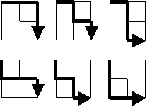

```{r}
#| include: false
#| file: euler/utils/setup.R
```


Starting in the top left corner of a $2 \times 2$ grid, and only being able to move to the right and down, there are exactly $6$ routes to the bottom right corner.

{fig-align="center"}

How many such routes are there through a $20 \times 20$ grid?



## Resources

- [Lattice Paths Problem | Algorithmic And Combinatorial Solution | FelixTechTips YouTube Video](https://www.youtube.com/watch?v=UplqE9mm490)
- [Combinations and Permutations](https://www.mathsisfun.com/combinatorics/combinations-permutations.html)

## Development

We see that at every vertex on the lattice that we only have 2 directions to choose from: right or down.

Another simple observation shows us that for any sized grid, because of the above mentioned rule, every single unique path is of the same length.

For the $2 \times 2$ grid, this is of length 4 (i.e. $2*2$), and for the $20 \times 20$ grid, this is length 40 (i.e. $2*20$).

Additionally, this length correlates 1-to-1 to the number of vertexes that each route runs through, where a right/down decision is made at each vertex.

Because only 2 directions can be chosen at each vertex, we understand that the total number of unique routes that can be taken can be modeled by calculating the non-repeated combinations on the lattice of directions that are made in a route.

This can be modeled as the length of the route (or number of vertexes where we make a decision on the lattice) (e.g. $n$) "choose" half of the length of the route (e.g. $k$), said colloquially as "n choose k". Why?

Since there are only 2 decisions/directions that can be made at each vertex on the lattice, we know that half of the directions choosen in the route will be down, and the other half will be right.

Righting out the combinations, say for $2 \times 2$, with $D$ for down, and $R$ for right, these 6 non-repeated combinations (routes) are the following:

$$\{RRDD, RDRD, RDDR, DDRR, DRDR, DRRD}$$

"n choose k" is written & calculated via the below formula. It is known as the combinations formula, and it is also called the [binomial coefficient](https://www.mathsisfun.com/data/binomial-distribution.html).

$$\binom{n}{k} = \frac{n!}{(n-k)!}*\frac{1}{k!} = \frac{n!}{k!(n-k)!}$$

Thus, for the $2 \times 2$ grid, the total number of routes (4 choose 2) is calculated as:

$$\binom{4}{2} = \frac{4!}{2!(4-2)!} = 6$$

Which correlates to the length of our set of routes above.

For the $20 \times 20$ grid, likewise, we calculate number of routes (40 choose 2) via the following:

$$\binom{40}{40/2} = \binom{40}{20} = \frac{40!}{20!(40-20)!} = \frac{40!}{20!^2}$$

## R

### Answer 1a - Combinatorial

```{r}
n <- 40
k <- 20

tic()
factorial(n)/factorial(k)^2
toc()
```

### Answer 1b - Combinatorial Built-In

```{r}
tic()
choose(40, 20)
toc()
```


